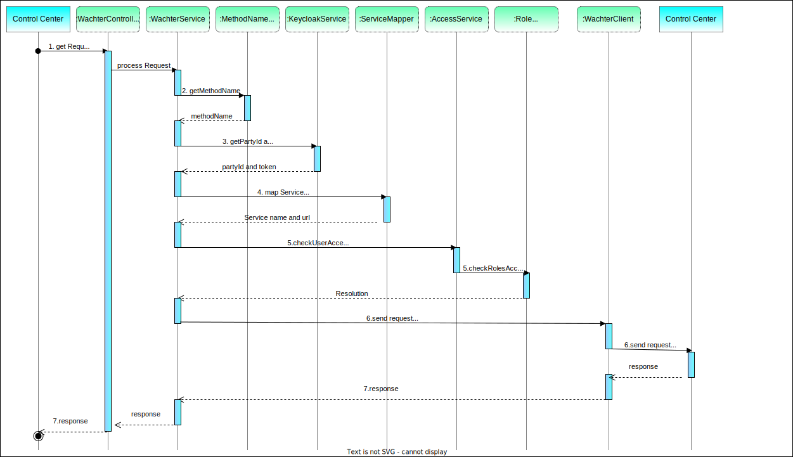

# wachter

Сервис предназначен для авторизации и проксирования вызовов от [control-center](https://github.com/valitydev/control-center).

## Описание работы сервиса

1. Wachter получает от [control-center](https://github.com/valitydev/control-center) запрос на проведение операции, 
содержащий токен и имя сервиса, в который необходимо спроксировать запрос. Имя сервиса получает из header "Service".
2. Из сообщения запроса wachter получает 
[имя метода](https://github.com/valitydev/wachter/blob/master/src/main/java/dev/vality/wachter/service/MethodNameReaderService.java)
3. В [KeycloakService](https://github.com/valitydev/wachter/blob/master/src/main/java/dev/vality/wachter/service/KeycloakService.java) 
wachter получает AccessToken. 
4. По имени сервиса из header wachter
[маппит](https://github.com/valitydev/wachter/blob/master/src/main/java/dev/vality/wachter/mapper/ServiceMapper.java)
url, на который необходимо спроксировать запрос.
5. Далее сервис проверяет возможность [авторизации](https://github.com/valitydev/wachter/blob/master/src/main/java/dev/vality/wachter/security/AccessService.java) 
пользователя, сравнивая полученные названия сервиса и метода от [control-center](https://github.com/valitydev/control-center)
с теми, что находятся в JWT токене. Доступ может быть разрешен как [ко всему сервису](https://github.com/valitydev/wachter/blob/master/src/main/java/dev/vality/wachter/security/RoleAccessService.java#L22), 
так и только к [отдельному методу](https://github.com/valitydev/wachter/blob/master/src/main/java/dev/vality/wachter/security/RoleAccessService.java#L22) сервиса.
6. Если доступ разрешен, сервис [отправляет запрос](https://github.com/valitydev/wachter/blob/master/src/main/java/dev/vality/wachter/client/WachterClient.java) 
на ранее смаппленный урл.
7. Полученный ответ [возвращает](https://github.com/valitydev/wachter/blob/master/src/main/java/dev/vality/wachter/controller/WachterController.java) control-center.

Схема работы сервиса:

